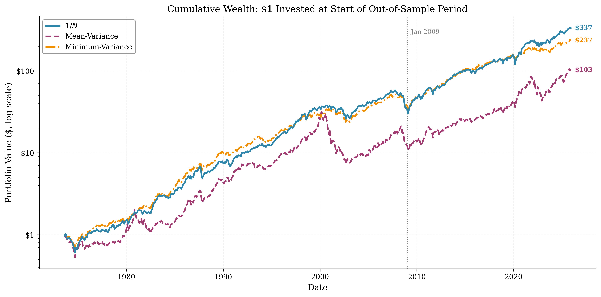

# Portfolio Optimization in Low Interest Environments

**Bachelor Thesis — Leo Abert**  
University of Konstanz — Department of Economics  
Supervisor: Prof. Dr. Marcel Fischer  
Advisor: Natascha Jankowski  
April 2026

---

## Overview

This code replicates and extends the out-of-sample portfolio comparison of [DeMiguel, Garlappi, and Uppal (2009)](https://doi.org/10.1093/rfs/hhm075) using [Fama-French 10 Industry Portfolios](https://mba.tuck.dartmouth.edu/pages/faculty/ken.french/data_library.html) with data updated through December 2025.

Three long-only strategies are compared:

1. **1/N equal-weighting** (naive diversification benchmark)
2. **Sample-based mean-variance optimization**
3. **Minimum-variance optimization**

Performance is evaluated using certainty-equivalent returns, Sharpe ratios, turnover, and welfare costs over a rolling 120-month estimation window. A subperiod analysis examines whether the post-2008 low interest rate environment alters the relative performance of these strategies.

---

## Key Results



- The **1/N portfolio** delivers the highest certainty-equivalent return (CEQ = 6.85%), outperforming both mean-variance (ΔCEQ = +2.28 pp) and minimum-variance (ΔCEQ = +0.69 pp), though neither difference is statistically significant at the 5% level.
- The **subperiod analysis** reveals a structural shift around January 2009: the 1/N advantage over mean-variance narrows from +2.96 pp to +0.87 pp, while minimum-variance flips from slight outperformance (−0.22 pp) to substantial underperformance (+2.57 pp).
- **Estimation error**, not transaction costs, is the primary driver: even at zero trading costs, 1/N retains a +1.47 pp welfare advantage over mean-variance.

---

## Repository Structure

```text
├── config.py                      # Central configuration: parameters, paths, constants
├── utils.py                       # Shared utility functions (optimization, metrics)
├── 01_build_dataset.py            # Loads and prepares the Fama-French 10 Industry data
├── 02_backtest.py                 # Core rolling-window backtest for all three strategies
├── 03_regime_comparison.py        # Subperiod analysis (pre/post January 2009)
├── 04_robustness_regressions.py   # OLS regressions (interest rate vs. relative performance)
├── 05_robustness_bootstrap.py     # Bootstrap confidence intervals for CEQ differences
├── 05b_subperiod_bootstrap.py     # Bootstrap inference within subperiods
├── 05c_sharpe_tests.py            # Sharpe ratio tests (Jobson-Korkie with Memmel correction)
├── 06_descriptive_stats.py        # Descriptive statistics for 10 industry portfolios
├── 07_export_table1.py            # Formats the full-sample performance table
├── 08_robustness_tables.py        # Window, gamma, and transaction cost sensitivity tables
├── 09_thesis_figures.py           # All thesis figures (wealth, weights, HHI, rates)
├── 99_validate_demiguel.py        # Validates results against DeMiguel et al. (2009) Table III
├── 99_final_checklist.py          # Automated quality assurance checks on all outputs
├── run_all.py                     # Master pipeline: runs all scripts in sequence
├── requirements.txt               # Python dependencies
├── data/
│   └── data_clean.csv             # Monthly returns + risk-free rate
└── output/
    ├── tables/                    # LaTeX and CSV tables
    └── figures/                   # PNG figures (300+ dpi)
```

---

## Data Source

The dataset (`data/data_clean.csv`) contains monthly returns for the Fama-French 10 Industry Portfolios and the 1-Month T-Bill rate.

**Sources:**

- [Kenneth R. French Data Library](https://mba.tuck.dartmouth.edu/pages/faculty/ken.french/data_library.html) → "10 Industry Portfolios" (monthly, value-weighted)
- Risk-free rate: 1-Month T-Bill from the same source
- [Federal Reserve Economic Data (FRED)](https://fred.stlouisfed.org/)
  - Series CPIAUCSL (Consumer Price Index), used to compute the real interest rate
  - Series VIXCLS (CBOE Volatility Index), used as a control variable in a robustness regression (not cited in the thesis text)

**Sample period:** August 1963 – December 2025 (full sample)  
**Out-of-sample period:** August 1973 – December 2025 (after M = 120 month burn-in)

---

## Requirements

Python 3.9 or higher.

```bash
pip install -r requirements.txt
```

---

## How to Run

```bash
python run_all.py
```

This executes all scripts in order (01 through 09) and saves output to `output/tables/`, `output/figures/`, and `output/`.

**Runtime:** approximately 5–10 minutes depending on hardware.

Individual scripts can also be run independently but must be executed in numerical order since later scripts depend on outputs from earlier ones.

> **Note:** `01_build_dataset.py` downloads interest rate data from FRED if a valid API key is configured in `config.py`. Without a key the script still succeeds using only the bundled `data/data_clean.csv` — all thesis results reproduce identically from the local dataset.

---

## Parameters (`config.py`)

| Parameter | Value | Description |
|-----------|-------|-------------|
| `M` | 120 | Estimation window length (months) |
| `GAMMA` | 1 | Coefficient of relative risk aversion |
| `TC` | 0.0050 | Transaction cost (50 bps, one-way) |
| `N` | 10 | Number of assets |
| `SPLIT_DATE` | 2009-01-01 | Subperiod split (pre-crisis / post-crisis) |

---

## Output Files

Filenames below reflect the internal pipeline structure and do not correspond one-to-one to the table and figure numbering in the final thesis PDF.

**Tables (LaTeX + CSV):**

| File | Description |
|------|-------------|
| `table1_full_sample` | Full-sample out-of-sample performance |
| `table1_descriptive_stats` | Descriptive statistics for 10 industries |
| `table2_subperiod` | Subperiod comparison (pre/post 2009) |
| `table3_window_robustness` | Estimation window sensitivity (M = 60, 90, 120, 180) |
| `table4_gamma_sensitivity` | Risk aversion sensitivity (γ = 1, 3, 5) |
| `table5_tc_sensitivity` | Transaction cost sensitivity (TC = 0, 25, 50, 100 bps) |

**Figures (PNG, 300+ dpi):**

| File | Description |
|------|-------------|
| `fig1_cumulative_wealth` | Cumulative wealth paths for all strategies |
| `fig2_mv_weights` | Mean-variance portfolio weight evolution |
| `fig3_minvar_weights` | Minimum-variance portfolio weight evolution |
| `fig4_hhi_timeseries` | Portfolio concentration (HHI) over time |
| `fig5_interest_rates` | 1-Month T-Bill rate with post-2008 shading |

---

## Reference

DeMiguel, V., Garlappi, L., and Uppal, R. (2009). "Optimal Versus Naive Diversification: How Inefficient is the 1/N Portfolio Strategy?" *Review of Financial Studies*, 22(5), 1915–1953. [DOI](https://doi.org/10.1093/rfs/hhm075)

---

## License

This project is licensed under the [MIT License](LICENSE).
